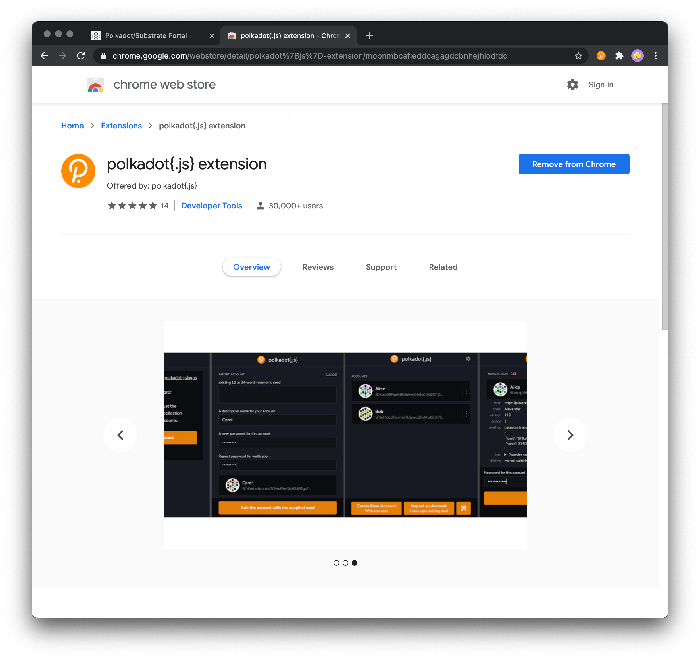
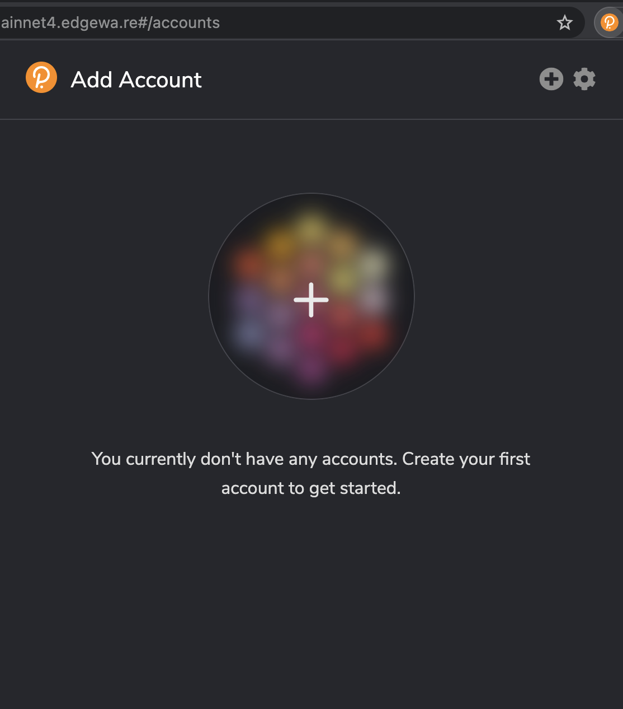
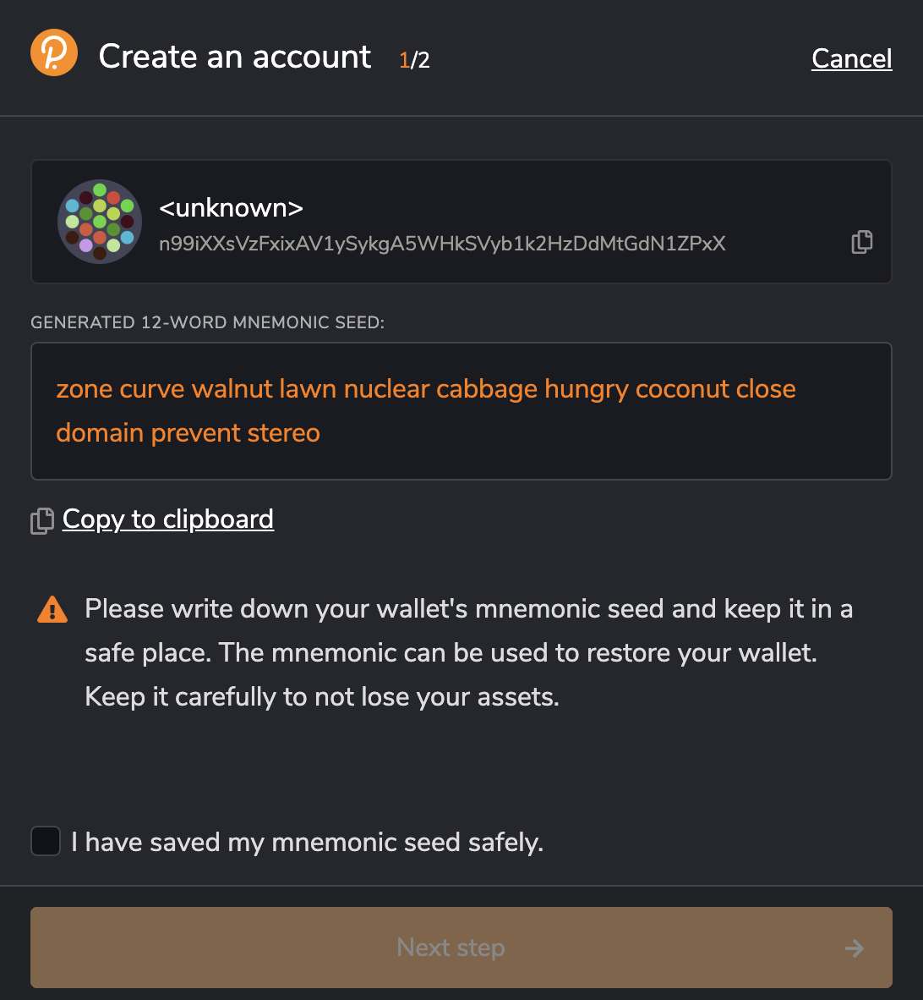
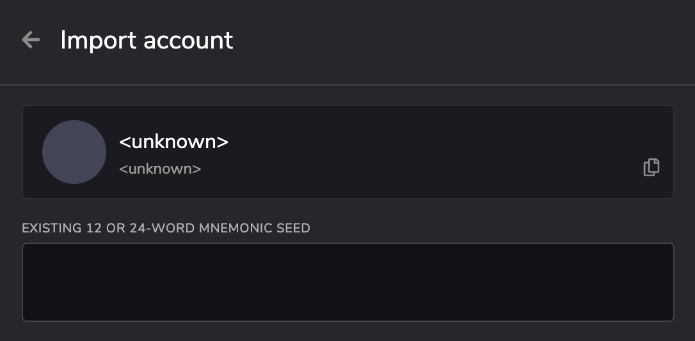
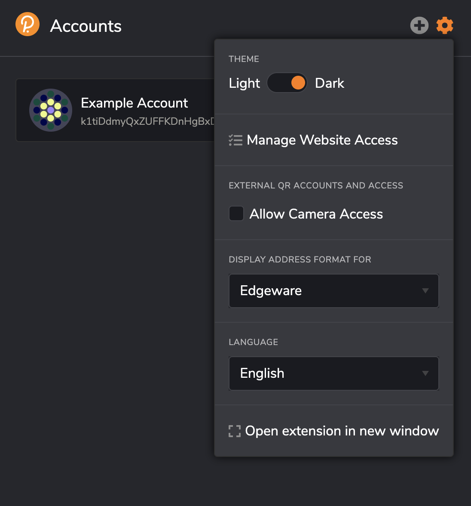
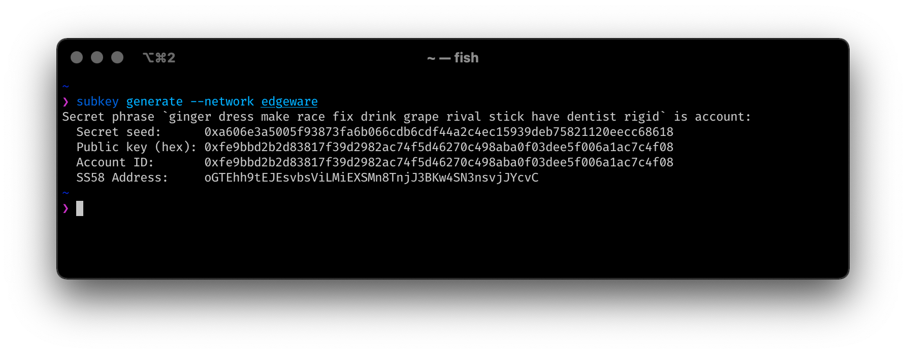
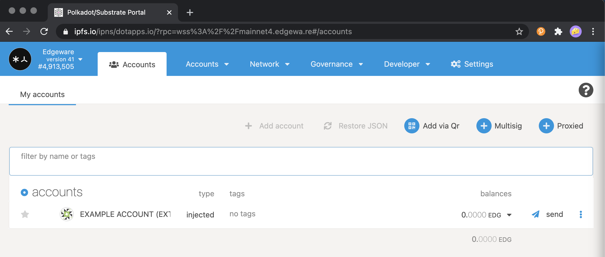

# Create an Account

An address is the public part of a Edgeware account. The private part is the key used to access this address. The public and private part together make up a Edgeware account. To interact with Edgeware chain create such as creating basic transactions and various operation, you need to have created Account.

There are several ways to generate a Edgeware account:

* [Polkadot{.js} Browser Plugin](create-an-account.md#polkadotjs-browser-plugin) - _We reccomend this for most users_
* [Subkey](create-an-account.md#subkey) - _Advanced and Most secure_
* [DotApps.io](create-an-account.md#dotappsio) \(known as Polkadot-JS Apps\)
* Parity Signer
* Ledger Hardware Wallet

## Storing your key safely

The seed is your **key** to the account. Knowing the seed allows you, or anyone else who knows the seed, to re-generate and control this account.

It is imperative to store the seed somewhere safe, secret, and secure. If you lose access to your account \(i.e. you forget the password for your account's JSON file\), you can re-create it by entering the seed. This also means that somebody else can have control over your account if they have access to your seed.

For maximum security, the seed should be written down on paper or another non-digital device and stored in a safe place. You may also want to protect your seed from physical damage, as well \(e.g. by storing in a sealed plastic bag to prevent water damage, storing it in a fireproof safe, etching it in metal, etc.\) It is recommended that you store multiple copies of the seed in geographically separate locations \(e.g., one in your home safe and one in a safety deposit box at your bank\).

You should definitely not store your seed on any kind of computer that has or may have access to the internet in the future.

## Storing your account's JSON file

The JSON file is encrypted with a password, which means you can import it into any wallet which supports JSON imports, but to then use it, you need the password. You don't have to be as careful with your JSON file's storage as you would with your seed \(i.e. it can be on a USB drive near you\), but remember that in this case your account is only as secure as the password you used to encrypt it. Do not use easy to guess or hard to remember passwords. It is good practice to use a [mnemonic password of four to five words](https://xkcd.com/936/). These are nearly impossible for computers to guess due to the number of combinations possible, but much easier for humans to remember.

## Polkadot{.js} Browser Plugin

The Polkadot{.js} plugin provides a reasonable balance of security and usability. It provides a separate local mechanism to generate your address and interact with Polkadot.

This method involves installing the Polkadot{.js} plugin and using it as a “virtual vault," separate from your browser, to store your private keys. It also allows signing of transactions and similar functionality.

It is still running on the same computer you use to connected to the internet with and thus is less secure than using Parity Signer or other air-gapped approaches.

## Install the Browser Plugin

The browser plugin is available for [both](https://polkadot.js.org/extension/) [Google Chrome \(and Chromium based browsers like Brave\)](https://chrome.google.com/webstore/detail/polkadot%7Bjs%7D-extension/mopnmbcafieddcagagdcbnhejhlodfdd) and [FireFox](https://addons.mozilla.org/en-US/firefox/addon/polkadot-js-extension/).

If you would like to know more or review the code of the plugin yourself, [you can visit the Github source repository](https://github.com/polkadot-js/extension).

After installing the plugin, you should see the orange and white Polkadot{.js} logo in the menu bar of your browser.

## Open Accounts

Navigate to [DotApps](https://ipfs.io/ipns/dotapps.io/?rpc=wss%3A%2F%2Fmainnet4.edgewa.re#/accounts). Click on the "Accounts" tab.

## Create Account

Open the Polkadot{.js} browser extension by clicking the logo on the top bar of your browser. You will see a browser popup not unlike the one below.

Click the big plus button or select "Create new account" from the small plus icon in the top right. The Polkadot{.js} plugin will then use system randomness to make a new seed for you and display it to you in the form of twelve words.

You should back up these words as explained above. It is imperative to store the seed somewhere safe, secret, and secure. If you cannot access your account via Polkadot{.js} for some reason, you can re-enter your seed through the "Add account menu" by selecting "Import account from pre-existing seed".

## Name Account

The account name is arbitrary and for your use only. It is not stored on the blockchain and will not be visible to other users who look at your address via a block explorer. If you're juggling multiple accounts, it helps to make this as descriptive and detailed as needed.

## Enter Password

The password will be used to encrypt this account's information. You will need to re-enter it when using the account for any kind of outgoing transaction or when using it to cryptographically sign a message.

Note that this password does NOT protect your seed phrase. If someone knows the twelve words in your mnemonic seed, they still have control over your account even if they do not know the password.

## Set Address for Edgeware Mainnet

Now we will ensure that the addresses are displayed as Edgeware mainnet addresses.

Click on "Options" at the top of the plugin window, and under "Display address format for" select "Edgeware".

Your address' format is only visual - the data used to derive this representation of your address are the same, so you can use the same address on multiple chains. However, for privacy reasons, we recommend creating a new address for each chain you're using.

## Subkey

Subkey is recommended for technically advanced users who are comfortable with the command line and compiling Rust code. Subkey allows you to generate keys on any device that can compile the code. Subkey may also be useful for automated account generation using an air-gapped device. It is not recommended for general users.

[You can find detailed build and usage instructions of subkey](https://github.com/paritytech/substrate/tree/master/bin/utils/subkey)

## DotApps.io

> Please note! If you use this method to create your account and clear your cookies in your browser, your account will be lost forever if you do not back it up. Make sure you store your seed phrase in a safe place, or download the account's JSON file if using the Polkadot{.js} browser extension. Learn more about account backup and restoration here.

**Using the DotApps.io user interface without the plugin is not recommended.** It is the least secure way of generating an account. It should only be used if all of the other methods are not feasible in your situation.

## Open DotApps.io

Navigate to [DotApps](https://ipfs.io/ipns/dotapps.io/?rpc=wss%3A%2F%2Fmainnet4.edgewa.re#/accounts) and click on "Accounts" underneath the Accounts tab. It is located in the navigation bar at the top of your screen.

## Start Account Generation

Click on the "Add Account" button. You should see a pop-up similar to the process encountered when using the [Polkadot JS Extension method](create-an-account.md#polkadotjs-browser-plugin) above. Follow the same instructions and remember to [store your seed safely](create-an-account.md#storing-your-key-safely)!

## Create and Back Up Account

Click “Save” and your account will be created. It will also generate a backup JSON file that you should safely store, ideally on a USB off the computer you're using. You should not store it in cloud storage, email it to yourself, etc.

You can use this backup file to restore your account. This backup file is not readable unless it is decrypted with the password.

## Reference

* [Account generation for Polkadot Relay chain](https://wiki.polkadot.network/docs/en/learn-account-generation)
* [SS58 Adress Transform](https://polkadot.subscan.io/tools/ss58_transform)

